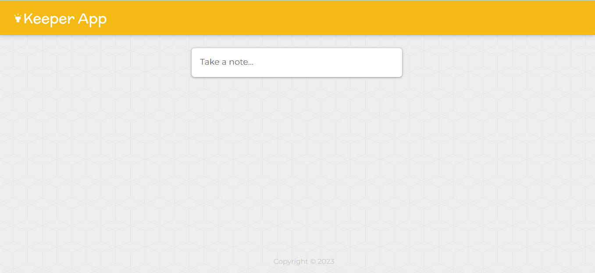
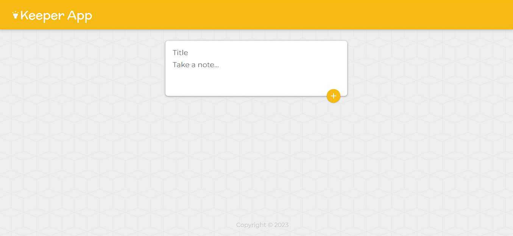
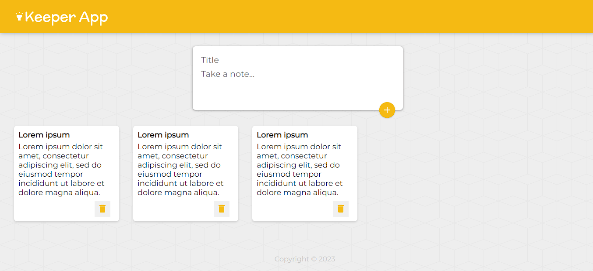

# Keeper App

The Keeper App is a user-friendly web application built with React.js that simplifies the task of organizing and managing your notes. Whether you're a student, professional, or just someone who loves jotting down thoughts, Keeper App offers a seamless and efficient way to create, organize, and delete notes.

## Features

- Intuitive User Interface
- Create Notes
- Delete Notes

## Screenshots

